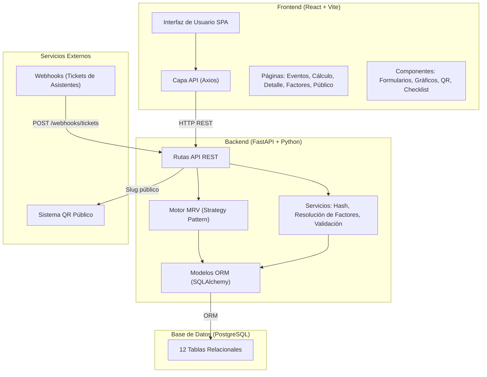
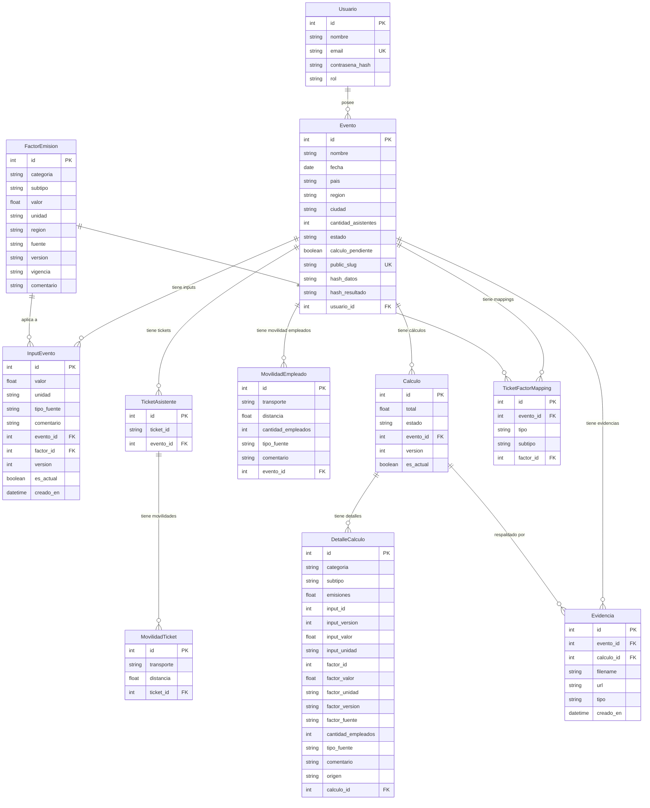
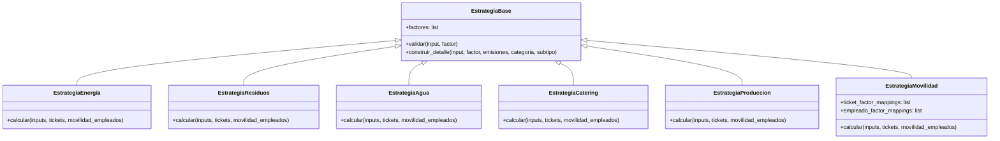
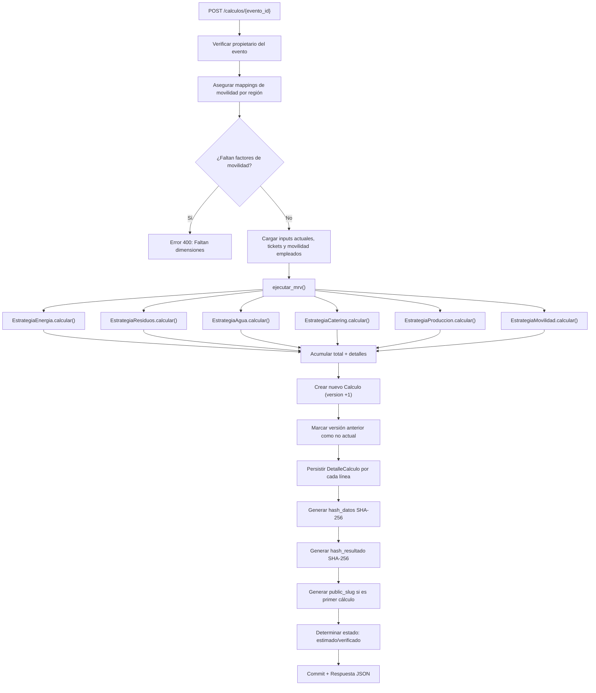
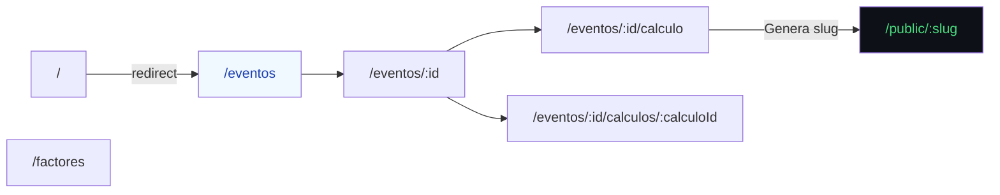
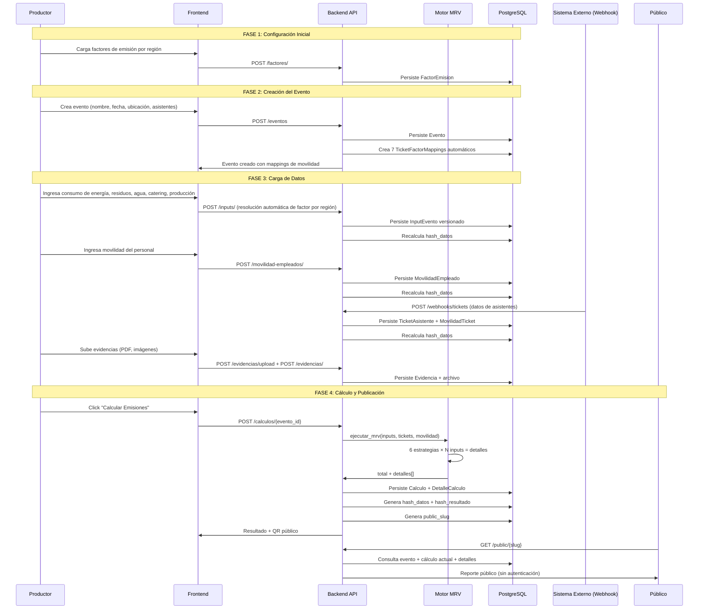

# 📋 Informe Técnico-Funcional de la Plataforma Guella

**Plataforma de Medición de Huella de Carbono para Eventos Masivos**

| Campo | Valor |
|---|---|
| **Nombre del Proyecto** | Guella MRV |
| **Versión** | 1.0.0 |
| **Fecha del Informe** | 3 de julio de 2026 |
| **Tipo de Documento** | Documentación Técnica y Funcional |

---

## 1. Resumen Ejecutivo

**Guella** es una plataforma web de tipo **MRV** (Measurement, Reporting & Verification — Medición, Reporte y Verificación) diseñada para calcular, auditar y publicar la **huella de carbono** generada por eventos masivos. La plataforma permite a productores de eventos cuantificar el impacto ambiental en unidades de **kgCO2e** (kilogramos de dióxido de carbono equivalente) a través de un sistema integral que contempla 6 categorías de emisión: energía, residuos, agua, catering, producción y movilidad.

El sistema opera bajo una arquitectura **cliente-servidor** desacoplada, con un backend API RESTful construido en **Python/FastAPI** y un frontend SPA (Single Page Application) desarrollado con **React/Vite**. Los datos persisten en una base de datos **PostgreSQL**, y la plataforma está preparada para despliegue en la nube con **Render** (backend) y **Vercel** (frontend).

> [!IMPORTANT]
> Guella no es simplemente una calculadora: implementa un pipeline MRV completo con **versionado de datos**, **hashing SHA-256** para integridad, **auditoría de trazabilidad** por cada línea de cálculo, y un sistema de **factores de emisión regionalizados** con resolución automática.

---

## 2. Problema que Resuelve

Los eventos masivos (festivales, conciertos, congresos, ferias) generan emisiones de gases de efecto invernadero provenientes de múltiples fuentes:

- **Consumo energético** (electricidad, generadores diésel/nafta, energía solar)
- **Gestión de residuos** (reciclables, orgánicos, rechazo)
- **Consumo de agua** (red pública, agua transportada)
- **Catering** (carne, opciones veganas/vegetarianas, bebidas)
- **Materiales de producción** (papel, plástico, textil, madera)
- **Movilidad** de asistentes y personal logístico (auto, moto, bus, tren, avión, bicicleta, caminata)

Guella centraliza la captura de todos estos datos, los vincula con **factores de emisión científicos verificables** y ejecuta un motor de cálculo que produce resultados trazables, auditables y publicables.

---

## 3. Arquitectura del Sistema

### 3.1. Visión General



### 3.2. Stack Tecnológico

| Capa | Tecnología | Versión | Propósito |
|---|---|---|---|
| **Frontend** | React | 19.2.6 | Interfaz de usuario reactiva |
| **Bundler** | Vite | 8.0.12 | Build tool y dev server |
| **Routing** | React Router DOM | 7.16.0 | Navegación SPA |
| **HTTP Client** | Axios | 1.16.1 | Comunicación con la API |
| **Estilos** | TailwindCSS | 3.4.4 | Sistema de diseño utility-first |
| **QR Codes** | qrcode.react | 4.2.0 | Generación de códigos QR |
| **Backend** | FastAPI | — | Framework API REST de alto rendimiento |
| **ORM** | SQLAlchemy | — | Mapeo objeto-relacional |
| **Migraciones** | Alembic | — | Migración de esquema de base de datos |
| **Base de Datos** | PostgreSQL | — | Persistencia relacional |
| **Servidor de Archivos** | StaticFiles (FastAPI) | — | Servir evidencias subidas |
| **Deploy Backend** | Render | — | Hosting del servidor API |
| **Deploy Frontend** | Vercel | — | Hosting estático del SPA |

### 3.3. Estructura de Directorios del Proyecto

```
Guella/
├── backend/
│   ├── app/
│   │   ├── main.py                    # Punto de entrada FastAPI
│   │   ├── core/
│   │   │   ├── configuracion.py       # Variables de entorno (.env)
│   │   │   ├── seguridad.py           # Autenticación y tokens
│   │   │   └── permisos.py            # Control de acceso a recursos
│   │   ├── db/
│   │   │   ├── base_de_datos.py       # Conexión SQLAlchemy + sesión
│   │   │   └── init_db.py             # Inicialización de tablas
│   │   ├── modelos/                   # 12 modelos ORM
│   │   │   ├── usuario.py
│   │   │   ├── evento.py
│   │   │   ├── factor_emision.py
│   │   │   ├── input_evento.py
│   │   │   ├── ticket_asistente.py
│   │   │   ├── movilidad_ticket.py
│   │   │   ├── movilidad_empleado.py
│   │   │   ├── calculo.py
│   │   │   ├── detalle_calculo.py
│   │   │   ├── evidencia.py
│   │   │   ├── ticket_factor_mapping.py
│   │   │   └── webhook_log.py
│   │   ├── esquemas/                  # Esquemas Pydantic de validación
│   │   ├── rutas/                     # 11 routers API
│   │   │   ├── autenticacion.py
│   │   │   ├── eventos.py
│   │   │   ├── inputs.py
│   │   │   ├── factores.py
│   │   │   ├── calculos.py
│   │   │   ├── webhooks.py
│   │   │   ├── movilidad_empleados.py
│   │   │   ├── evidencias.py
│   │   │   ├── public.py
│   │   │   ├── ticket_factor_mappings.py
│   │   │   └── dashboard.py
│   │   ├── servicios/
│   │   │   ├── hash_service.py        # Integridad SHA-256
│   │   │   ├── factores/
│   │   │   │   ├── region.py          # Normalización de regiones
│   │   │   │   └── resolutor.py       # Resolución automática de factores
│   │   │   └── mrv/
│   │   │       ├── engine.py          # Motor de cálculo MRV
│   │   │       ├── estado.py          # Determinación estimado/verificado
│   │   │       ├── validador.py       # Validación de factores
│   │   │       └── estrategias/       # Patrón Strategy por categoría
│   │   │           ├── base.py
│   │   │           ├── energia.py
│   │   │           ├── residuos.py
│   │   │           ├── agua.py
│   │   │           ├── catering.py
│   │   │           ├── produccion.py
│   │   │           └── movilidad.py
│   │   └── seeds/
│   │       └── seed_factores.py       # Datos de prueba
│   ├── alembic/                       # Migraciones de esquema
│   ├── uploads/                       # Almacenamiento de evidencias
│   ├── .env                           # Configuración de entorno
│   └── requirements.txt              # Dependencias Python
│
├── frontend/
│   ├── src/
│   │   ├── App.jsx                    # Componente raíz
│   │   ├── main.jsx                   # Punto de entrada React
│   │   ├── axios.js                   # Configuración global Axios
│   │   ├── pages/                     # 6 páginas principales
│   │   │   ├── Eventos.jsx
│   │   │   ├── EventoDetalle.jsx
│   │   │   ├── Calculo.jsx
│   │   │   ├── DetalleCalculoHistorico.jsx
│   │   │   ├── Factores.jsx
│   │   │   └── Publico.jsx
│   │   ├── components/                # 12+ componentes reutilizables
│   │   ├── api/                       # 11 módulos de comunicación API
│   │   ├── routes/
│   │   │   └── RutasApp.jsx           # Definición de rutas SPA
│   │   └── utilidades/                # Helpers y constantes
│   ├── index.html
│   ├── package.json
│   ├── vite.config.js
│   ├── tailwind.config.js
│   └── vercel.json                    # Configuración de deploy Vercel
│
└── README.md
```

---

## 4. Modelo de Datos

### 4.1. Diagrama Entidad-Relación



### 4.2. Descripción Detallada de Entidades

#### **Usuario**
Representa al productor o administrador del evento. Cada usuario puede gestionar múltiples eventos. El sistema implementa roles (`admin`, `productor`) para control de acceso.

#### **Evento**
Entidad central de la plataforma. Contiene la metadata del evento masivo (nombre, fecha, ubicación geográfica, cantidad de asistentes) y actúa como contenedor de todos los datos de emisión. Incluye campos de trazabilidad:
- `public_slug`: Identificador único para la URL pública del reporte.
- `hash_datos`: Hash SHA-256 de todos los datos de entrada al momento del cálculo.
- `hash_resultado`: Hash SHA-256 que incluye datos de entrada + resultado del cálculo.
- `calculo_pendiente`: Flag booleano que indica si los datos han cambiado desde el último cálculo.

#### **FactorEmision**
Almacena los factores de emisión científicos que convierten unidades de consumo a kgCO2e. Cada factor está definido por:
- **Categoría**: energía, residuos, agua, catering, producción, movilidad.
- **Subtipo**: Por ejemplo, dentro de energía → electricidad, diesel_generador, nafta_generador, solar.
- **Valor**: Coeficiente numérico de conversión.
- **Unidad**: kwh, litros, kg, km.
- **Región**: Permite regionalización de factores (ej: factores diferentes para Argentina vs. Europa).
- **Fuente y Versión**: Trazabilidad científica (ej: DEFRA v1).

#### **InputEvento**
Datos de consumo ingresados manualmente por el productor del evento. Implementa **versionado**: cada modificación crea una nueva versión, conservando el historial completo. El campo `es_actual` indica cuál versión es la vigente.

#### **TicketAsistente y MovilidadTicket**
Representan la movilidad de los asistentes al evento. Los tickets se ingresan vía **webhook** externo (por ejemplo, desde un sistema de ticketería). Cada ticket puede tener hasta 5 movilidades (tramos de viaje con diferente transporte).

#### **MovilidadEmpleado**
Registra la movilidad del personal logístico del evento. Se ingresa manualmente con tipo de transporte, distancia total y cantidad de empleados que realizaron ese trayecto.

#### **Calculo y DetalleCalculo**
El **Calculo** almacena el total de emisiones y su versión. Cada cálculo tiene un conjunto de **DetalleCalculo** que provee trazabilidad completa línea por línea: qué input se usó, con qué factor, cuántas emisiones produjo, y si el origen fue un input manual, un ticket de asistente o movilidad de empleados.

#### **Evidencia**
Archivos de soporte (PDF, imágenes, Excel, CSV, ZIP) subidos al servidor y vinculados a eventos y cálculos para respaldo documental de auditoría.

#### **TicketFactorMapping**
Tabla de mapeo que vincula cada tipo de transporte de movilidad con el factor de emisión correspondiente para un evento específico. Se resuelve automáticamente basándose en la región del evento.

---

## 5. Motor de Cálculo MRV

### 5.1. Patrón de Diseño: Strategy

El motor de cálculo implementa el **patrón Strategy** para desacoplar la lógica de cálculo de cada categoría de emisión. Esto permite agregar nuevas categorías sin modificar el código existente.



### 5.2. Fórmula de Cálculo

Para las categorías basadas en inputs (energía, residuos, agua, catering, producción):

```
Emisiones (kgCO2e) = Valor del Input × Factor de Emisión
```

**Ejemplo**: Si un evento consumió **22.000 kWh** de electricidad y el factor de emisión para electricidad es **0.343 kgCO2e/kWh**:

```
22.000 × 0.343 = 7.546 kgCO2e
```

Para **movilidad de empleados**:

```
Emisiones (kgCO2e) = Distancia (km) × Factor de Emisión (kgCO2e/km)
```

Para **movilidad de asistentes** (tickets):

```
Emisiones (kgCO2e) = Distancia del tramo (km) × Factor de Emisión del transporte (kgCO2e/km)
```

### 5.3. Flujo de Ejecución del Motor



### 5.4. Categorías y Subtipos Soportados

| Categoría | Subtipos | Unidad | Ejemplo de Factor |
|---|---|---|---|
| **Energía** | electricidad, diesel_generador, nafta_generador, solar | kWh / litros | 0.343 kgCO2e/kWh (electricidad) |
| **Residuos** | reciclable, orgánico, rechazo | kg | 0.57 kgCO2e/kg (rechazo) |
| **Agua** | red, transportada | litros | 0.000298 kgCO2e/litro (red) |
| **Catering** | carne, vegano, vegetariano, bebidas | kg / litros | 27.0 kgCO2e/kg (carne) |
| **Producción** | papel, plástico, textil, madera | kg | 8.2 kgCO2e/kg (textil) |
| **Movilidad** | auto, moto, bici, bus, tren, avión, caminata | km | 0.192 kgCO2e/km (auto) |

### 5.5. Contrato de Validación

El sistema implementa un **validador estricto** ([validador.py](file:///c:/Users/usuario/Desktop/Guella/backend/app/servicios/mrv/validador.py)) que verifica:

1. **Categoría válida**: Solo se aceptan las 6 categorías definidas.
2. **Subtipo válido**: Cada subtipo debe pertenecer a su categoría correspondiente.
3. **Unidad correcta**: Se valida que la unidad del factor coincida con el contrato de unidades predefinido (ej: electricidad → kWh, no litros).

Además, la clase `EstrategiaBase` implementa un **safeguard** en tiempo de cálculo que verifica que la unidad del input coincida con la del factor asignado.

---

## 6. Sistema de Integridad: Hashing SHA-256

### 6.1. Propósito

El servicio de hashing ([hash_service.py](file:///c:/Users/usuario/Desktop/Guella/backend/app/servicios/hash_service.py)) genera huellas digitales criptográficas que garantizan la **inmutabilidad y verificabilidad** de los datos y resultados.

### 6.2. Tipos de Hash

| Hash | Incluye | Propósito |
|---|---|---|
| **hash_datos** | Inputs + Tickets + Movilidad empleados | Verificar que los datos de entrada no fueron alterados |
| **hash_resultado** | Datos + Detalles del cálculo + Total | Verificar que el resultado es consistente con los datos |

### 6.3. Proceso de Generación

1. Se recopilan todos los inputs actuales, tickets con sus movilidades, y movilidades de empleados.
2. Se ordenan determinísticamente (por ID, por ticket_id, por transporte+distancia).
3. Se serializan a JSON con `sort_keys=True` para garantizar orden consistente.
4. Se aplica `hashlib.sha256()` sobre el texto serializado en UTF-8.
5. El hash resultante (64 caracteres hexadecimales) se almacena en el evento.

> [!TIP]
> Los hashes se recalculan cada vez que se modifica, agrega o elimina cualquier dato de entrada del evento, lo que permite detectar cambios no autorizados.

---

## 7. Sistema de Resolución Automática de Factores

### 7.1. Resolución por Región

El sistema [resolutor.py](file:///c:/Users/usuario/Desktop/Guella/backend/app/servicios/factores/resolutor.py) implementa la resolución automática de factores de emisión basándose en la **región geográfica** del evento.

**Flujo de resolución**:

1. Se normaliza la región del evento (minúsculas, sin acentos, sin espacios extras) usando [region.py](file:///c:/Users/usuario/Desktop/Guella/backend/app/servicios/factores/region.py).
2. Se buscan candidatos en la tabla `factores_emision` por categoría y subtipo.
3. Se selecciona el factor cuya región normalizada coincida con la del evento.
4. Se prioriza la versión más reciente del factor (ordenado por `version DESC, id DESC`).

### 7.2. Sincronización Automática de Mappings

La función `asegurar_mappings_movilidad()` se ejecuta proactivamente en múltiples puntos del sistema:

- Al **crear un evento** → se crean los 7 mappings de movilidad automáticamente.
- Al **consultar el detalle** de un evento → se sincronizan los mappings.
- Al **listar inputs** → se actualizan factores a la versión más reciente.
- Al **consultar mappings** de un evento → se ejecuta la resolución.
- Antes de **calcular** → validación final de que todos los factores están presentes.

Esto garantiza que si un administrador carga un nuevo factor de emisión para una región, los eventos existentes en esa región se actualizan automáticamente.

### 7.3. Deduplicación por Versión

La función `deduplicar_ultima_version()` conserva solo la versión más reciente de cada combinación categoría/subtipo para una región dada, evitando duplicación de factores obsoletos.

---

## 8. Sistema de Versionado

### 8.1. Versionado de Inputs

Cada `InputEvento` implementa versionado por factor:

1. Al crear o modificar un input, se busca la versión máxima existente para ese `evento_id + factor_id`.
2. La versión anterior se marca como `es_actual = False`.
3. Se crea un nuevo registro con `version = anterior + 1` y `es_actual = True`.
4. El historial completo se conserva y es consultable vía `GET /inputs/{input_id}/historial`.

### 8.2. Versionado de Cálculos

Cada `Calculo` es inmutable una vez creado:

1. Al ejecutar un nuevo cálculo, el anterior se marca como `es_actual = False`.
2. El nuevo cálculo se crea con `version = anterior + 1` y `es_actual = True`.
3. Todos los `DetalleCalculo` se vinculan al nuevo cálculo, conservando trazabilidad completa.
4. Solo el cálculo activo puede consultarse públicamente; los históricos son accesibles desde el panel del productor.

> [!NOTE]
> El cálculo activo (`es_actual = True`) no puede eliminarse. Solo los históricos pueden borrarse.

---

## 9. API REST: Endpoints Completos

### 9.1. Autenticación

| Método | Endpoint | Descripción |
|---|---|---|
| `POST` | `/auth/login` | Autenticación con email/password, retorna JWT |

### 9.2. Eventos

| Método | Endpoint | Descripción |
|---|---|---|
| `POST` | `/eventos` | Crear nuevo evento |
| `GET` | `/eventos` | Listar todos los eventos (con cálculo actual) |
| `GET` | `/eventos/{id}` | Obtener detalle de un evento |
| `GET` | `/eventos/{id}/calculos` | Historial de cálculos del evento |
| `GET` | `/eventos/{id}/resumen` | Resumen con contadores (inputs, tickets, movilidades, evidencias) |
| `GET` | `/eventos/{id}/evidencias` | Listar evidencias del evento |
| `DELETE` | `/eventos/{id}` | Eliminar evento y datos asociados (cascade) |

### 9.3. Inputs (Datos de Emisión)

| Método | Endpoint | Descripción |
|---|---|---|
| `POST` | `/inputs/` | Crear input versionado con resolución automática de factor |
| `GET` | `/inputs/evento/{id}` | Listar inputs actuales del evento |
| `GET` | `/inputs/{id}/historial` | Historial de versiones de un input |
| `DELETE` | `/inputs/{id}` | Eliminar input (restaura versión anterior si existe) |

### 9.4. Factores de Emisión

| Método | Endpoint | Descripción |
|---|---|---|
| `POST` | `/factores/` | Crear nuevo factor con validación completa |
| `GET` | `/factores/` | Listar factores (filtrable por evento_id → filtra por región) |
| `DELETE` | `/factores/{id}` | Eliminar factor (con verificación de dependencias) |

### 9.5. Cálculos

| Método | Endpoint | Descripción |
|---|---|---|
| `POST` | `/calculos/{evento_id}` | Ejecutar cálculo MRV completo |
| `GET` | `/calculos/evento/{id}` | Obtener cálculo actual del evento |
| `GET` | `/calculos/{id}` | Obtener cálculo por ID |
| `GET` | `/calculos/{id}/detalle` | Obtener detalles línea a línea |
| `DELETE` | `/calculos/{id}` | Eliminar cálculo histórico (no el activo) |

### 9.6. Webhooks (Tickets de Asistentes)

| Método | Endpoint | Descripción |
|---|---|---|
| `POST` | `/webhooks/tickets` | Registrar ticket con movilidades (1-5 tramos) |
| `GET` | `/webhooks/tickets/{evento_id}` | Listar tickets del evento |
| `DELETE` | `/webhooks/tickets/{id}` | Eliminar ticket |

### 9.7. Movilidad de Empleados

| Método | Endpoint | Descripción |
|---|---|---|
| `POST` | `/movilidad-empleados/` | Registrar movilidad de empleados |
| `GET` | `/movilidad-empleados/evento/{id}` | Listar movilidades del evento |
| `DELETE` | `/movilidad-empleados/{id}` | Eliminar movilidad |

### 9.8. Evidencias

| Método | Endpoint | Descripción |
|---|---|---|
| `POST` | `/evidencias/upload` | Subir archivo (PDF, imagen, Excel, etc.) |
| `POST` | `/evidencias/` | Crear registro de evidencia vinculado al evento/cálculo |
| `GET` | `/evidencias/{id}` | Obtener detalle de evidencia |
| `DELETE` | `/evidencias/{id}` | Eliminar evidencia (archivo + registro) |

### 9.9. Mappings de Factores de Movilidad

| Método | Endpoint | Descripción |
|---|---|---|
| `GET` | `/eventos/{id}/movilidad-factor-mapping/{tipo}` | Obtener mappings con resolución automática |

### 9.10. Acceso Público (Sin Autenticación)

| Método | Endpoint | Descripción |
|---|---|---|
| `GET` | `/public/evento/{slug}` | Reporte público del evento |
| `GET` | `/public/{slug}` | Ruta de compatibilidad |

---

## 10. Frontend: Páginas y Flujos de Usuario

### 10.1. Mapa de Navegación



### 10.2. Descripción de Páginas

#### **Eventos** (`/eventos`)
Panel principal que lista todos los eventos. Muestra tarjetas con el nombre del evento, fecha, ubicación, cantidad de asistentes, estado del cálculo y el total de emisiones del cálculo activo. Incluye un modal para crear nuevos eventos.

#### **Detalle del Evento** (`/eventos/:id`)
Vista completa del evento con:
- **4 tarjetas de resumen**: Asistentes, Estado (Sin cálculo / Pendiente / Calculado), Versión del cálculo activo, Huella total.
- **Auditoría visual**: Gráficos de barras y torta con desglose por categoría y por origen de emisión.
- **Hashes de integridad**: Visualización de hash_datos y hash_resultado.
- **Código QR público**: Generado automáticamente tras el primer cálculo, con enlace a la página pública.
- **Historial de cálculos**: Lista navegable de todas las versiones.
- **Gestión de evidencias**: Formulario para subir archivos de soporte con selector de dimensión asociada.

#### **Cálculo** (`/eventos/:id/calculo`)
Página operativa donde el productor:
1. Visualiza las **dimensiones de movilidad** resueltas automáticamente por región.
2. Ingresa **datos de emisión** (inputs) seleccionando la dimensión y el valor.
3. Registra **movilidad logística** del personal con transporte, distancia y personas.
4. Revisa la **lista verificable** de todos los inputs cargados (con tipo de fuente: real/estimado).
5. Visualiza los **tickets** recibidos por webhook.
6. Ejecuta el botón **"Calcular Emisiones"** que dispara el motor MRV.
7. Tras el cálculo, se muestra el resultado con total en kgCO2e, versión, estado, y QR de la página pública.

#### **Detalle de Cálculo Histórico** (`/eventos/:id/calculos/:calculoId`)
Vista de auditoría de un cálculo histórico específico, con desglose línea por línea de cada detalle de cálculo.

#### **Factores** (`/factores`)
Panel de administración de factores de emisión. Permite crear nuevos factores con todos los campos requeridos (categoría, subtipo, valor, unidad, región, fuente, versión, vigencia). Muestra tarjetas informativas con cada factor, su fuente científica y región de aplicación.

#### **Página Pública** (`/public/:slug`)
Reporte público de huella de carbono accesible sin autenticación, diseñado para ser compartido vía QR o enlace directo. Presenta:

- **Encabezado** con nombre del evento, fecha, ubicación y cantidad de asistentes.
- **Indicador circular animado** del total de emisiones en kgCO2e con efecto de conteo progresivo y anillos de pulso.
- **Equivalencias interactivas**: Traduce las emisiones a métricas comprensibles:
  - 🌳 **Compensación Forestal**: Árboles necesarios para compensar (÷ 22 kgCO2e/árbol/año).
  - 🚗 **Kilómetros en coche**: Distancia equivalente (÷ 0.12 kgCO2e/km).
  - 📱 **Cargas de smartphone**: Cantidad de recargas equivalentes (÷ 0.0083 kgCO2e/carga).
- **Gráficos de auditoría**: Barras y torta por categoría de impacto y por origen de la emisión.
- **Diseño oscuro premium** con glassmorphism, micro-animaciones y diseño responsive.

---

## 11. Sistema de Webhooks

### 11.1. Propósito

El endpoint de webhooks (`POST /webhooks/tickets`) permite que sistemas externos de ticketería envíen datos de movilidad de los asistentes directamente a la plataforma. Esto automatiza la captura de datos de transporte sin intervención manual del productor.

### 11.2. Payload Esperado

```json
{
  "evento_id": 1,
  "ticket_id": "QR-001",
  "movilidades": [
    {
      "transporte": "auto",
      "distancia": 45.5
    },
    {
      "transporte": "bus",
      "distancia": 12.0
    }
  ]
}
```

### 11.3. Validaciones

- **Unicidad**: `ticket_id` + `evento_id` debe ser único (constraint de base de datos).
- **Movilidades**: Mínimo 1, máximo 5 tramos por ticket.
- **Transportes válidos**: auto, moto, bici, bus, tren, avión, caminata.
- **Distancia**: Debe ser mayor a 0.
- **Propiedad del evento**: Se verifica que el usuario autenticado sea propietario.

### 11.4. Efecto en el Sistema

Al recibir un ticket, el sistema automáticamente:
1. Persiste el ticket y sus movilidades.
2. Recalcula el `hash_datos` del evento.
3. Marca `calculo_pendiente = True` para indicar que hay datos nuevos sin calcular.

---

## 12. Sistema de Evidencias

### 12.1. Tipos de Archivos Soportados

PDF, DOC, DOCX, XLS, XLSX, CSV, JPG, JPEG, PNG, WEBP, ZIP.

### 12.2. Flujo de Carga

1. El usuario selecciona un archivo y lo sube a `POST /evidencias/upload`.
2. El servidor genera un nombre UUID único para evitar colisiones.
3. El archivo se almacena en el directorio `uploads/` del servidor.
4. Se crea un registro `Evidencia` vinculado al evento y opcionalmente al cálculo activo.
5. El usuario puede asociar la evidencia a una dimensión específica (ej: "energía - electricidad") para auditoría.

### 12.3. Eliminación

Al eliminar una evidencia, el sistema:
1. Elimina el archivo físico del directorio `uploads/` si existe.
2. Elimina el registro de la base de datos.

---

## 13. Determinación del Estado: Estimado vs. Verificado

El servicio [estado.py](file:///c:/Users/usuario/Desktop/Guella/backend/app/servicios/mrv/estado.py) implementa la lógica de determinación del estado del cálculo:

```
Si ≥ 80% de los datos son de tipo_fuente = "real" → Estado = "verificado"
Si < 80% de los datos son de tipo_fuente = "real" → Estado = "estimado"
Si no hay datos → Estado = "estimado" (por defecto)
```

El conteo incluye tanto los `InputEvento` como las `MovilidadEmpleado`, cada uno con su campo `tipo_fuente` que puede ser `"real"` o `"estimado"`.

> [!NOTE]
> Esta regla del 80% permite que un evento tenga datos parcialmente verificados y aún así se considere estimado, incentivando al productor a verificar la mayor cantidad de fuentes posible.

---

## 14. Seguridad y Control de Acceso

### 14.1. Estado Actual

El módulo [seguridad.py](file:///c:/Users/usuario/Desktop/Guella/backend/app/core/seguridad.py) implementa un sistema de autenticación simplificado para desarrollo:

- `obtener_usuario_actual()`: Retorna un usuario administrador fijo (ID=1).
- `asegurar_admin_fijo()`: Crea automáticamente un usuario admin si no existe en la base de datos.

### 14.2. Permisos

El módulo [permisos.py](file:///c:/Users/usuario/Desktop/Guella/backend/app/core/permisos.py) implementa:

- `verificar_admin()`: Valida que el usuario tenga rol "admin".
- `verificar_propietario_evento()`: Verifica que el evento exista (la validación de propiedad por usuario está simplificada en la versión actual).

### 14.3. CORS

El backend configura CORS dinámicamente mediante la variable de entorno `FRONTEND_URL`, permitiendo múltiples orígenes separados por coma para soportar tanto desarrollo local como producción.

---

## 15. Despliegue

### 15.1. Backend (Render)

- La variable `DATABASE_URL` apunta a la base de datos PostgreSQL.
- La variable `FRONTEND_URL` configura los orígenes CORS permitidos.
- Los archivos de evidencia se sirven estáticamente desde `/uploads/`.

### 15.2. Frontend (Vercel)

El archivo `vercel.json` configura reescritura de rutas para que la SPA funcione correctamente:

```json
{
  "rewrites": [
    { "source": "/(.*)", "destination": "/" }
  ]
}
```

La variable `VITE_API_RENDER` configura la URL base del backend en producción.

---

## 16. Datos de Prueba (Seed)

El archivo [seed_factores.py](file:///c:/Users/usuario/Desktop/Guella/backend/app/seeds/seed_factores.py) genera un dataset completo de prueba:

| Recurso | Cantidad | Detalle |
|---|---|---|
| **Usuario** | 1 | Productor Demo (productor@guella.com) |
| **Eventos** | 2 | Festival Córdoba 2026 (5.000 asistentes) + Concierto Buenos Aires 2026 (3.200 asistentes) |
| **Factores** | 24 | Todas las categorías y subtipos con región "Global" y fuente DEFRA |
| **Inputs** | 34 | 17 inputs por evento (todas las dimensiones excepto movilidad) |
| **Movilidad Empleados** | 6 | 3 por evento (auto, bus, tren) |
| **Tickets** | 60 | 40 para el primer evento + 20 para el segundo |
| **Evidencias** | 3 | Facturas y certificados de prueba |

---

## 17. Flujo Operativo Completo



---

## 18. Glosario Técnico

| Término | Definición |
|---|---|
| **MRV** | Measurement, Reporting & Verification — Marco metodológico para medir, reportar y verificar emisiones de GEI |
| **kgCO2e** | Kilogramos de dióxido de carbono equivalente — Unidad estándar de medición de huella de carbono |
| **Factor de Emisión** | Coeficiente científico que convierte una unidad de consumo (kWh, litros, kg, km) en kgCO2e |
| **GEI** | Gases de Efecto Invernadero |
| **DEFRA** | Department for Environment, Food & Rural Affairs — Fuente de referencia para factores de emisión del Reino Unido |
| **Slug** | Identificador único legible en URL para acceso público |
| **Hash SHA-256** | Función de resumen criptográfico de 256 bits para verificar integridad de datos |
| **Input** | Dato de consumo registrado manualmente por el productor del evento |
| **Ticket** | Registro de movilidad de un asistente, típicamente recibido vía webhook |
| **Mapping** | Vinculación automática entre un tipo de transporte y su factor de emisión para un evento |
| **Strategy Pattern** | Patrón de diseño que encapsula algoritmos intercambiables en clases separadas |
| **Versionado** | Sistema de control de versiones que conserva el historial completo de cambios |

---

> [!IMPORTANT]
> Este documento refleja el estado actual de la plataforma Guella v1.0.0. La arquitectura está diseñada para ser extensible: nuevas categorías de emisión se agregan creando una nueva estrategia en el motor MRV sin modificar el código existente.
